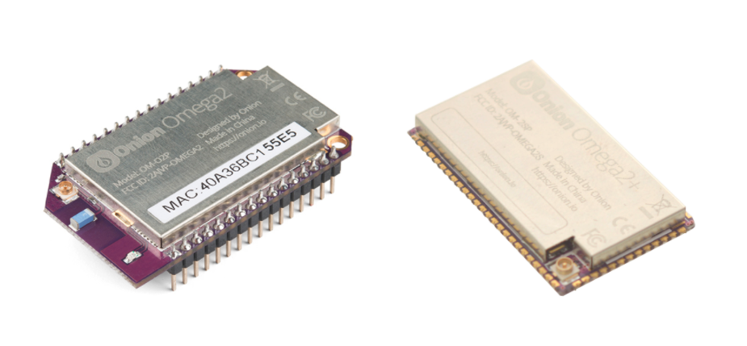

# Onion Omega2 & Omega2S Firmware Build System

This buildsystem for the OpenWRT Linux distribution has been modified by Onion Corporation to build firmware for the Onion Omega2 and Omega2S family of devices.

The buildsystem can be used to create software packages and firmware images for Omega2 and Omega2S devices.



## Using this Build System

This document is meant to give a quickstart intro and point you in the right direction on using the build system and customizing the output firmware images to suit your needs.

See the [OpenWRT documentation on the build system](https://openwrt.org/docs/guide-developer/build-system/start) for more detailed descriptions and advanced usage.

What's covered in this document:

- [A Note of Warning](#a-note-of-warning)
- [Step 1: Preparing the Build System](#step-1-preparing-the-build-system)
  * [Recommended Machine Specs](#recommended-machine-specs)
  * [Options for Using the Build System](#options-for-using-the-build-system)
  * [Updating the Build System](#updating-the-build-system)
- [Step 2: Compiling the Build System](#step-2-compiling-the-build-system)
  * [How to Compile](#how-to-compile)
  * [Multi-Core Compilation](#multi-core-compilation)
  * [Reducing Compile Time with the Minimal Build Configuration](#reducing-compile-time-with-the-minimal-build-configuration)
  * [Where to Find the Compile Output](#where-to-find-the-compile-output)
  * [How to Debug Compilation Issues](#how-to-debug-compilation-issues)
- [Step 3: Customizing the Firmware Image](#step-3-customizing-the-firmware-image)
  * [Choosing which Packages to Include in the Firmware](#choosing-which-packages-to-include-in-the-firmware)
  * [Adding Custom Files to the Firmware Image](#adding-custom-files-to-the-firmware-image)
  * [Making your Own Software Packages](#making-your-own-software-packages)
- [Step 4: Deploying your Custom Firmware to Devices](#step-4-deploying-your-custom-firmware-to-devices)
  * [Manually Flashing the Firmware](#manually-flashing-the-firmware)
  * [More Control over Firmware Updates](#more-control-over-firmware-updates)
  * [Hosting your own Firmware Server](#hosting-your-own-firmware-server)
- [Contributing](#contributing)
- [Appendix](#appendix)
  * [Notes on the Build System](#notes-on-the-build-system)
  * [Working with the Build System Configuration File](#working-with-the-build-system-configuration-file)
  * [Additional Reading](#additional-reading)


# A Note of Warning

**Make sure to proceed with caution, it's possible to brick or even permanently damage your device by flashing a firmware that's not configured properly.** Onion Corporation is not responsible for any damage to your device caused by using custom firmware or packages not built and released by Onion Corporation.

But this shouldn't be too much of a cause for concern since bricked devices can usually be restored using the bootloader. See our documentation on using the bootloader to flash new firmware to the device. There are 2 options:

1. [Web recovery mode](http://docs.onion.io/omega2-docs/Firmware-Flashing-Web-Recovery.html) (requires ethernet and UART0 access)
2. [Flashing firmware from USB Storage](http://docs.onion.io/omega2-docs/Firmware-Flashing-from-USB-storage.html) (requires USB and UART0 access)


# Step 1: Preparing the Build System

**We strongly recommend first building firmware with the default configuration and THEN adding your own customizations**

What's covered in this step:

* [Recommended Machine Specs](#recommended-machine-specs)
* [Options for Using the Build System](#options-for-using-the-build-system)
	+ [Option A: Using the Docker Image](#option-a-using-the-docker-image)
	+ [Option B: Using a Linux System](#option-b-using-a-linux-system)
* [Updating the Build System](#updating-the-build-system)
	+ [Updating the Package Feeds](#updating-the-package-feeds)
		- [Updating the Onion Package Feed](#updating-the-onion-package-feed)
		- [Updating All Feeds](#updating-all-feeds)
		- ["Installing" New Packages](#installing-new-packages)
	+ [Grabbing the Latest Build System Code](#grabbing-the-latest-build-system-code)

## Recommended Machine Specs

Minimum specs:

* At least 8GB RAM
* A modern, powerful CPU - the more cores on the processor, the faster the build system compilation

For reference, at Onion, we generally use a server (like AWS EC2) when working with the build system.

## Options for Using the Build System

There are two preferred ways to use the buildsystem:

1. Using the `onion/omega2-source` Docker image **Recommended method**
2. Running the build system on a Linux system

### Option A: Using the Docker Image

The Docker image takes care of all environmental configuration and is the recommended method. We recommend getting familiar with how Docker before trying this procedure.

> **We recommend running Docker on a Linux system**.

Procedure:

1. Install Docker on your system: https://www.docker.com/get-started
2. Pull our Docker image by running:
```
docker pull onion/omega2-source
```
3. Once the image has been pulled to your computer, you can run your own container based on the image:
```
docker run -it onion/omega2-source /bin/bash
```
4. Your container will now be up and running! You'll be using it for the rest of the steps outlined below.

### Option B: Using a Linux System

**Not recommended for beginners**

Procedure to setup the build system on a Ubuntu Linux System:

1. Setup Linux environment by installing the required packages:
```
sudo apt-get update
sudo apt-get install -y build-essential vim git wget curl subversion build-essential libncurses5-dev zlib1g-dev gawk flex quilt git-core unzip libssl-dev python-dev python-pip libxml-parser-perl default-jdk rsync time
```

2. Download the Build System from Github:
```
git clone https://github.com/OnionIoT/source.git
cd source
```

3. Prepare build system:
```
sh scripts/onion-feed-setup.sh
python scripts/onion-setup-build.py
```
> This will initialize & configure all the package feeds as well as setup the `.config` file to match this repo. With these commands, the firmware built will match the official firmware released by Onion.

4. The build system is ready to be used to make firmware images and software packages

## Updating the Build System
*Applies to both Docker and Linux System installations*

Once you've setup your build system and have been using it, you'll want to update it from time to time.

### Updating the Package Feeds

In OpenWrt, a package "feed" is a collection of predefined build recipes (package makefiles) for software packages. Generally, feeds reside in version control systems on remote servers.

As feeds are generally under development, it's possible for your local copy of the feed to become out of date. In this case, you'll want to update the package feeds.

See the [OpenWRT documentation on package feeds](https://openwrt.org/docs/guide-developer/feeds) to learn more.

#### Updating the Onion Package Feed

To update the [Onion package feed](https://github.com/OnionIoT/openwrt-packages), run this command:

```
./scripts/feeds update onion
```

> Run this command if you're seeing compilation issues errors in Onion packages, this will likely fix the problem. If not, let us know on the [Onion Community](http://community.onion.io/).

#### Updating All Feeds

To update all of the feeds, run this command:

```
./scripts/feeds update -a
```

#### "Installing" New Packages

If new packages have been added to the package feeds, they will not show up in the `menuconfig` until "installed" to the build system using `./scripts/feeds install <PKG NAME>`.

See the [OpenWRT documentation on the feeds script](https://openwrt.org/docs/guide-developer/feeds#working_with_feeds) for more info.

### Grabbing the Latest Build System Code

To grab the latest code from this repo, run:

```
git pull
```

If you've made modifications to which packages are built/included in the firmware, these changes will be reflected in your local `.config` file.

**Create a backup copy of your `.config` file before proceeding.** The `git pull` command will not work unless the `.config` file is restored to it's original state by running `git checkout .config` and running `git pull` again. **Note that this will REMOVE all of your customizations!**

# Step 2: Compiling the Build System

What's covered in this step:

* [How to Compile](#how-to-compile)
  + [The Compile Command](#the-compile-command)
* [Multi-Core Compilation](#multi-core-compilation)
* [Reducing Compile Time with the Minimal Build Configuration](#reducing-compile-time-with-the-minimal-build-configuration)
* [Where to Find the Compile Output](#where-to-find-the-compile-output)
  + [Firmware Images](#firmware-images)
  + [Software Packages](#software-packages)
* [How to Debug Compilation Issues](#how-to-debug-compilation-issues)

## How to Compile

**Optional:** to make the compilation MUCH quicker, run the following command:

```
python scripts/onion-setup-build.py -c .config.O2-minimum
```

> Learn more about minimum build [below](#reducing-compile-time-with-the-minimal-build-configuration).

### The Compile Command

Run this command to compile the build system:

```
make
```

> The compilation can take some time! On the scale of hours depending on your machine. See the two following sections for ideas on reducing compile time.

This will create:

* Firmware images for the Omega2, Omega2+, and Omega2 Pro (same as those released by Onion)
* Software packages (every package included in the firmware and included in the [Onion Package Repo](http://repo.onioniot.com/omega2/packages/))

## Multi-Core Compilation

For faster compilation, use `make -j N`, where N is the number of CPU cores + 1

## Reducing Compile Time with the Minimal Build Configuration

To **significantly reduce compile time**, you can configure the build system for a minimal build. This means the build system will only build packages that are **included** in the firmware.

```
python scripts/onion-setup-build.py -c .config.O2-minimum
```

> Learn more about changing the build system configuration in the [appendix](#working-with-the-build-system-configuration-file).

## Where to Find the Compile Output

### Firmware Images

Firmware images can be found at `bin/targets/ramips/mt76x8/`:

| Devices            | Product SKU              | Firmware Image                                           |
|--------------------|--------------------------|----------------------------------------------------------|
| Omega2 & Omega2S   | OM-O2 & OM-O2S           | openwrt-ramips-mt76x8-omega2-squashfs-sysupgrade.bin     |
| Omega2+ & Omega2S+ | OM-O2P & OM-O2SP         | openwrt-ramips-mt76x8-omega2p-squashfs-sysupgrade.bin    |
| Omega2 Pro         | OM-O2PRO                 | openwrt-ramips-mt76x8-omega2pro-squashfs-sysupgrade.bin  |
| Omega2 LTE         | OM-O2LTE-NA & OM-O2LTE-G | openwrt-ramips-mt76x8-omega2lte-squashfs-sysupgrade.bin  |
| Omega2 Dash        | OM-O2DASH                | openwrt-ramips-mt76x8-omega2dash-squashfs-sysupgrade.bin |

To learn more about compiling images for the Omega2 LTE and Omega2 Dash, see the [appendix](#working-with-the-build-system-configuration-file).

### Software Packages

Software package files can be found at `bin/packages/mipsel_24kc/`, separated by directories named by each package feed.

Additional core software packages (including kernel modules) can be found at `bin/targets/ramips/mt76x8/packages`


## How to Debug Compilation Issues

If you're encountering errors during compilation, you'll likely see something like the following:

```
make -r world: build failed. Please re-run make with -j1 V=s to see what's going on
/root/source/include/toplevel.mk:198: recipe for target 'world' failed
make: *** [world] Error 1
```

To get more visibility into the error, re-run your compilation as the error prompt suggests:

```
make -j1 V=s
```

The error messages will point you in the direction of the package responsible for the compilation error.

* If the problematic package is from Onion, see the [Updating the Package Makefiles](#updating-the-build-system) section above. This will likely resolve your issue.
* If the problematic package is not related to Onion packages, it's likely due to environment issues or issues with the code. Please check with the original authors to get pointers for debugging.


# Step 3: Customizing the Firmware Image

Now that you've successfully prepared and compiled the build system, you're ready to make customizations to suit your individual needs!

What's covered in this step:

* [Choosing which Packages to Include in the Firmware](#choosing-which-packages-to-include-in-the-firmware)
  + [Tip: Reducing Firmware Image Size](#tip-reducing-firmware-image-size)
  + [Tip: Kernel Modules](#tip-kernel-modules)
  + [Tip: Custom Web Apps or Pages](#tip-custom-web-apps-or-pages)
* [Adding Custom Files to the Firmware Image](#adding-custom-files-to-the-firmware-image)
* [Making your Own Software Packages](#making-your-own-software-packages)
  + [Package Feeds](#package-feeds)
  + [Software Package Makefiles](#software-package-makefiles)
  + [Examples of Package Makefiles](#examples-of-package-makefiles)

**Refer to [Step 2: Compiling the Build System](#step-2-compiling-the-build-system) for info on building and debugging.**

See the [OpenWRT documentation on the build system](https://openwrt.org/docs/guide-developer/build-system/use-buildsystem) for more details.


## Choosing which Packages to Include in the Firmware

The build system has a text-based GUI called `menuconfig` that can be used to select which packages will be included in the firmware images (among other things).

To start it, run:

```
make menuconfig
```

Navigation:

* Use the **up and down arrow keys** to navigate
* **Enter** to go into sub-menus
* **Escape+Escape** to go out of a sub-menu

Selecting a Package:

* When you've found a package you want include or remove, press **space** to cycle through the selection options
* Selection options:
	* `<*>` = package will be **included in the firmare image**
	* `<M>` = package will be **compiled as a stand-alone package**, but not included in the firmware image. *See [Step 2 for info on where to find package output](#software-packages).*
	* `< >` = package will **not** be included in firmware or compiled as a stand-alone package

Searching for a Package:

* Press `/` to activate the search menu
* Type in a search term and press **Enter**
* Use the up and down arrow keys to scroll through the results
* Press Escape+Escape to leave the search menu

Exiting menuconfig:

* Navigate up to the top-level menu
* Press **Escape+Escape** to exit menuconfig
* If you've made changes, you will be prompted if the new configuration should be saved. Use the left and right arrow keys to choose between `Yes` and `No`, press **Enter** to make your selection
* If you've saved your changes, they will be reflected in the `.config` file

See the [OpenWRT documentation on menuconfig](https://openwrt.org/docs/guide-developer/build-system/use-buildsystem#make_menuconfig) for more details and advanced usage.

### Tip: Reducing Firmware Image Size

By reducing the amount of packages and files included in the firmware, the size of the resulting firmware image will be reduced. A smaller firmware image means more free space on the device.

Logical, but worth mentioning.

### Tip: Kernel Modules

For WiFi driver stability, we recommend not changing the selection of kernel modules. If you really need to remove a kernel module from the firmware image, keep it compiled as a stand-alone package.

### Tip: Custom Web Apps or Pages

If your requirements include a customized web page or web app to run on the Omega, ie you need files installed in `/www` on the device, you will need to make sure the `onion-os` package is NOT included in the firmware.

## Adding Custom Files to the Firmware Image

The build system offers a **very** straight forward method for adding custom files to the firmware image:

**Just drop the desired files into the `files` directory in the build system**

The directory structure within `files` will correspond to the `/` directory on the device.

Say you wanted your firmware image to include a `config.json` file in the `/root` directory, your build system should then have a `files/root/config.json` file.

**When to use this:** should be used for configuration or helper files, especially if those files will not change much.

**When NOT to use this:** this is not a very efficient way to include binaries or applications in your firmware images. See the [next section for info on packaging your applications](#making-your-own-software-packages).

See the [OpenWRT documentation on custom files](https://openwrt.org/docs/guide-developer/build-system/use-buildsystem#custom_files) for more details.

## Making your Own Software Packages

Creating your own software package is the best way to include your own custom applications in firmware images.

Benefits:

* Easy versioning - software packages have version numbers built in and recognized by the opkg package manager
* Easy to update the application - just use the [opkg package manager](http://docs.onion.io/omega2-docs/using-opkg.html) on the device
* Repeatable process for building your application

### Package Feeds

Two options for making your own package:

1. Create your own package feed
    * Pro: Proper and maintainable - will make for easy firmware builds and easier future development
    * Pro: Flexible - feed source code can be version controlled, zipped up, or even just local files
    * Con: Needs more up-front work to get set up
2. Add it to one of the existing package feeds
    * Pro: Quick to get up and running
    * Con: Less maintainable and robust - It's generally a good idea to version control your package makefiles for repeatability and future development

For more info on working with feeds, see the [OpenWRT feed documentation](https://openwrt.org/docs/guide-developer/feeds). Specifically, check out these sections:

* [Feed configuration](https://openwrt.org/docs/guide-developer/feeds#feed_configuration)
* [Custom feeds](https://openwrt.org/docs/guide-developer/feeds#custom_feeds)

### Software Package Makefiles

Once you've sorted out your feed, you'll need to create a **Package Makefile**. The Package Makefile acts like a build recipe for your package. It defines:

* The package name and version number
* Where to get the source code (Git repo, locally, etc)
* Where the package can be found in the menuconfig
* What other packages it depends on
* Compilation instructions (if required)
* Instructions on what to install on the device and where

For more details on this process, see the [OpenWRT documentation on creating a package](https://openwrt.org/docs/guide-developer/packages).

### Examples of Package Makefiles

For examples of package makefiles, see the [Onion Package feed on GitHub](https://github.com/OnionIoT/OpenWRT-Packages).

Specific examples on types of packages:

* C application with a regular makefile - Cross-compile from GitHub source and install the resulting binary: https://github.com/OnionIoT/OpenWRT-Packages/blob/openwrt-18.06/omega2-ctrl/Makefile
* C application that uses cmake and depends on libraries: https://github.com/OnionIoT/OpenWRT-Packages/blob/openwrt-18.06/ogps/Makefile
* Installing files from a GitHub repo: https://github.com/OnionIoT/OpenWRT-Packages/blob/openwrt-18.06/onion-ubus/Makefile
* Install files bundled with the package makefile and dependent packages: https://github.com/OnionIoT/OpenWRT-Packages/tree/openwrt-18.06/omega2pro


# Step 4: Deploying your Custom Firmware to Devices

Once you've built your own firmware images, you'll want to flash the image to a device. And potentially start thinking about how to update devices in the field.

What's covered in this step:

* [Manually Flashing the Firmware](#manually-flashing-the-firmware)
* [More Control over Firmware Updates](#more-control-over-firmware-updates)
* [Hosting your own Firmware Server](#hosting-your-own-firmware-server)


## Manually Flashing the Firmware

To flash the output firmware image on your device, you will need to:

1. Transfer the firmware image to the device (Use the /tmp directory)
1. Use the `sysupgrade` utility to flash the firmware image to the device's on-board flash storage

For details on this process, see the [Onion documentation article on manual firmware installation](http://docs.onion.io/omega2-docs/manual-firmware-installation.html).

Keep in mind Step 1 from the article will be different in your case since you'll want to use your own firmware image. And not a firmware image from the Onion firmware repository.

**When to use this method:** During development when the firmware is changing rapidly *(since this is a quick but manual process)*

**When NOT to use this method:** Updated devices deployed in the field since you'll likely want more control over the process

## More Control over Firmware Updates

The [oupgrade software package](https://github.com/OnionIoT/oupgrade) (part of the [Onion package feed](https://github.com/OnionIoT/openwrt-packages)) is meant to facilitate firmware updates on devices.

It is designed to:

1. Check the version info of the firmware currently on the device
1. Check the Onion firmware server for available latest and stable releases
1. Perform an upgrade if necessary

> In this context, a firmware server consists of an online repository to hold the firmware images, and an API to provide information about firmware releases.
> The Onion firmware repository can be found here: http://repo.onioniot.com/omega2/images/

Learn more about [using oupgrade in the Onion documentation](http://docs.onion.io/omega2-docs/using-the-omega-updating.html).

## Hosting your own Firmware Server

To have full control over the firmware upgrades on your deployed devices, you can create and host your own firmware server.

By default, oupgrade will check against the Onion firmware API and only when manually run on the device. However, **oupgrade can also be configured to use a different firmware server and behave more automatically**.

Specifically, it can be configured to:

* [Point to your own firmware API](https://github.com/OnionIoT/oupgrade#specifying-firmware-api-url)
* [Automatically check for updates based on a time interval](https://github.com/OnionIoT/oupgrade#automatic-updates)
* [Respond to the firmware API to acknowledge a firmware update](https://github.com/OnionIoT/oupgrade#acknowledging-firmware-updates)

To guide users in building their own firmware API, Onion has made an example implementation of a firmware API written in NodeJS available on GitHub. Learn more here: https://github.com/OnionIoT/OTA-Server-Sample

In addition to the firmware API, you will also need a firmware repo to hold the firmware images. Tools like AWS S3 can be used for this purpose.


---

# Contributing

Contributions are welcome!

We'll be following the OpenWRT contribution guidelines:

To help keep the codebase consistent and readable,
and to help people review your contribution,
we ask you to follow the rules you find in the wiki at this link
https://openwrt.org/submitting-patches

## Package Requests

We will not be accepting any contributions that just enable compilation of software packages.

You can instead try enabling the OpenWRT package repos on your Omega2 to install the software package you need.

More info on that here: http://docs.onion.io/omega2-docs/using-opkg.html#you-dont-have-a-package-i-wantneed

# Appendix

* [Notes on the Build System](#notes-on-the-build-system)
* [Working with the Build System Configuration File](#working-with-the-build-system-configuration-file)
  + [Available Configuration Files](#available-configuration-files)
  + [Changing Configuration Examples](#changing-configuration-examples)
* [Additional Reading](#additional-reading)

## Notes on the Build System

* This build system is used to generate firmware images for the following Omega2 devices,
* All released firmware images for Omega2 products were generated with this build system. The images can be found at http://repo.onioniot.com/omega2/images/ for the following devices:
	* Omega2 & Omega2S *(SKUs: OM-O2/OM-O2S)*
	* Omega2+ & Omega2S+ *(SKUs: OM-O2P/OM-O2SP)*
	* Omega2 Pro *(SKU: OM-O2PRO)*
	* Omega2 LTE *(SKUs: OM-O2LTE-NA & OM-O2LTE-G)*
	* Omega2 Dash *(SKU: OM-O2DASH)*
* This build system generates firmware for the M7688 SoC with Onion's Enhanced Warp Core WiFi driver
	* It is available as an [OpenWRT package](https://github.com/OnionIoT/OpenWRT-Packages/tree/openwrt-18.06/wifi-warp-core) for systems running Linux Kernel 4.14.81
		* **See [this post for more details on the Warp Core](https://onion.io/2bt-brand-new-os-release/)**

## Working with the Build System Configuration File

The `.config` file holds all of the configuration for the build system: which platform and device to build for, which packages to build, which packages should be included in the firmware image, etc.

After completing [Step 1]((#step-1-preparing-the-build-system)) in this guide, you'll notice the `.config` file is a symlink.

The `onion-setup-build.py` script can be used to point to several pre-made configuration files:

```
python scripts/onion-setup-build.py -c <CONFIG FILE>
```

> Also try running `python scripts/onion-setup-build.py --help` to see the usage info

### Available Configuration Files

| Configuration File | Creates Firmware Images for | Notes                                                                                                                       |
|--------------------|-----------------------------|-----------------------------------------------------------------------------------------------------------------------------|
| `.config.O2`         | Omega2, Omega2+, Omega2 Pro | Baseline configuration file for the Omega2. Also compiles all software packages that are included in the Onion Package Repo |
| `.config.O2-minimum` | Omega2, Omega2+, Omega2 Pro | Quick minimum build. Only compiles software packages that are included in the firmware                                      |
| `.config.O2LTE`      | Omega2 LTE                  | Configured to create images and required packages for the Omega2 LTE device                                                 |
| `.config.O2Dash`     | Omega2 Dash                 | Configured to create images and required packages for the Omega2 Dash device                                                |

### Changing Configuration Examples

To compile firmware images for the **Omega2 LTE**, run the following and then [compile the build system](#the-compile-command):

```
python scripts/onion-setup-build.py -c .config.O2LTE
```

To compile firmware images for the **Omega2 Dash**, run the following and then [compile the build system](#the-compile-command):

```
python scripts/onion-setup-build.py -c .config.O2Dash
```

## Additional Reading

* See [`CHANGELOG.md`](./CHANGELOG.md) for a listing of the changes for each firmware version and build
* **Onion Corporation is not responsible for any damage to your device caused by using custom firmware or packages not built and released by Onion Corporation.** See [`DISCLAIMER.md`](./DISCLAIMER.md) for Onion's disclaimer regarding this build system
